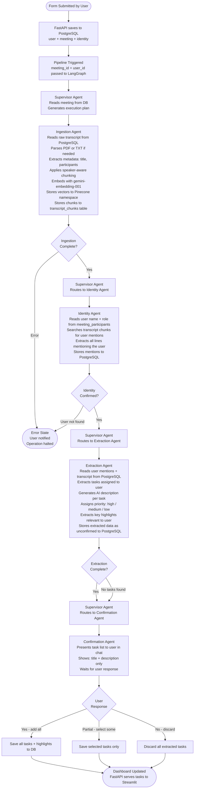
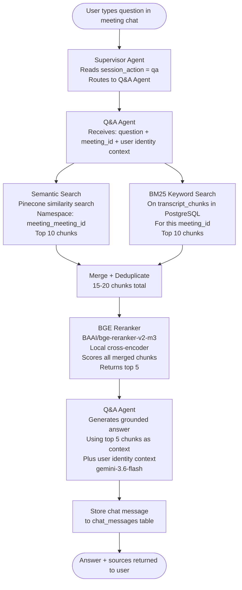
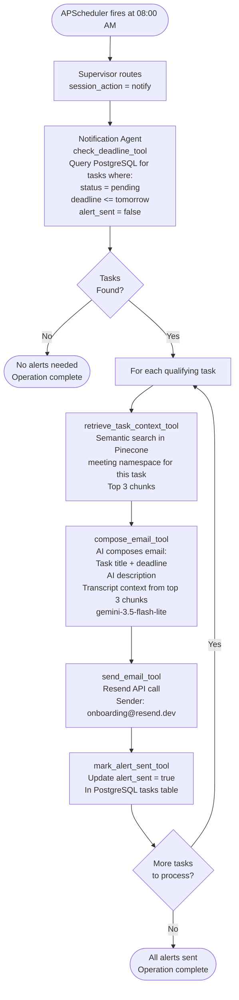

# AGENT_FLOW.md — MeetMind AI Meeting Assistant

---

## 1. AGENT ROSTER

| Agent | Responsibility | Model | Pattern | Tools |
|-------|---------------|-------|---------|-------|
| Supervisor Agent | Reads meeting from DB, generates execution plan, routes to correct sub-agent, aggregates results | gemini-3.6-flash | Plan-and-Execute | route_to_agent_tool, aggregate_response_tool |
| Ingestion Agent | Reads raw transcript from DB, parses format, extracts metadata, chunks, embeds, stores to Pinecone + PostgreSQL | gemini-3.5-flash-lite | ReAct | parse_pdf_tool, parse_txt_tool, extract_metadata_tool, store_transcript_tool, embed_and_store_tool |
| Identity Agent | Reads user name + role from DB, searches transcript for mentions, extracts user context, stores mentions | gemini-3.5-flash-lite | ReAct | search_participant_tool, extract_user_mentions_tool, confirm_identity_tool |
| Extraction Agent | Reads mentions + transcript from DB, extracts tasks + highlights for user, generates descriptions + priorities | gemini-3.5-flash-lite | ReAct | extract_tasks_tool, generate_task_description_tool, assign_priority_tool, extract_highlights_tool |
| Confirmation Agent | Presents tasks to user (title + description only), waits for yes/no/partial, saves confirmed data to DB | gemini-3.5-flash-lite | ReAct | present_tasks_tool, save_confirmed_tasks_tool, save_confirmed_highlights_tool |
| Q&A Agent | Hybrid RAG Q&A scoped to one meeting namespace, identity-aware, reranked, source-attributed | gemini-3.6-flash | ReAct | hybrid_search_tool, rerank_tool, generate_answer_tool |
| Notification Agent | Daily deadline check, RAG context retrieval per task, AI email composition, Resend delivery | gemini-3.5-flash-lite | ReAct | check_deadline_tool, retrieve_task_context_tool, compose_email_tool, send_email_tool, mark_alert_sent_tool |

---

## 2. ORCHESTRATION PATTERN

**Primary Pattern: Plan-and-Execute (Supervisor) + ReAct (all sub-agents)**

The Supervisor Agent uses the Plan-and-Execute pattern:
1. Reads the current meeting record and session action from PostgreSQL + LangGraph state
2. Generates a structured execution plan listing which agents to call in which order
3. Routes to the first agent in the plan
4. After each agent completes, reads the updated state and routes to the next agent
5. After all agents complete, aggregates results into a final response

Each sub-agent uses the ReAct pattern:
1. Receives its input from LangGraph state (populated from PostgreSQL)
2. Reasons about what action to take next (which tool to call)
3. Calls the tool
4. Observes the tool result
5. Reasons about whether another tool call is needed
6. Repeats until its responsibility is complete
7. Writes output back to LangGraph state

**Routing mechanism:**
The Supervisor reads `session_action` from LangGraph state and routes via conditional edges:

```
session_action = "ingest"   → ingestion_node
session_action = "identify" → identity_node
session_action = "extract"  → extraction_node
session_action = "confirm"  → confirmation_node
session_action = "qa"       → qa_node
session_action = "notify"   → notification_node
```

After each sub-agent completes, it updates `session_action` in state to the next required action. The graph loops back to the supervisor node which reads the new action and routes accordingly. This continues until `session_action` is set to `"complete"` or an error occurs.

**Fallback routing:**
If Gemini API quota is exhausted or returns an error:
- gemini-3.6-flash → fallback to thinkingmachines/inkling:free via OpenRouter
- gemini-3.5-flash-lite → fallback to thinkingmachines/inkling:free via OpenRouter
- If OpenRouter also fails → error state set, user notified, operation halted gracefully

---

## 3. AGENT FLOW DIAGRAM

### MAIN PIPELINE (triggered by new meeting form submission)



---

### Q&A PIPELINE (independent, triggered any time after ingestion)



---

### NOTIFICATION PIPELINE (triggered daily at 08:00 AM by APScheduler)



---

## 4. PER-AGENT DETAIL

---

### AGENT 1 — SUPERVISOR AGENT

**Responsibility:** Orchestrates the entire pipeline. Reads meeting and session context from PostgreSQL and LangGraph state. Generates a structured execution plan before routing. Routes to the correct sub-agent based on `session_action`. Aggregates sub-agent outputs into a final response.

**Model:** gemini-3.6-flash

**Pattern:** Plan-and-Execute

**Tools:**
- `route_to_agent_tool` — determines next agent based on session_action
- `aggregate_response_tool` — combines sub-agent outputs into final user-facing response

**Input Schema:**
```python
class SupervisorInput(BaseModel):
    user_id: str
    meeting_id: str
    session_action: str   # ingest | identify | extract | confirm | qa | notify
    context: dict         # whatever the previous agent returned
```

**Output Schema:**
```python
class SupervisorOutput(BaseModel):
    next_agent: str
    execution_plan: list[str]
    final_response: Optional[str]
    error: Optional[str]
```

**Failure Handling:**
- If next agent cannot be determined → set error in state, return graceful message to user
- If execution plan generation fails → retry once with fallback model, then halt

---

### AGENT 2 — INGESTION AGENT

**Responsibility:** Reads raw transcript from PostgreSQL. Parses PDF or TXT format if needed. Extracts meeting metadata (title, date, participant names). Applies speaker-aware chunking (200-300 tokens, 50 token overlap, speaker label preserved per chunk). Embeds chunks using gemini-embedding-001 (3072 dimensions). Stores vectors to Pinecone under `meeting_{meeting_id}` namespace. Stores raw chunks with full metadata to transcript_chunks table in PostgreSQL.

**Model:** gemini-3.5-flash-lite

**Pattern:** ReAct

**Tools:**
- `parse_pdf_tool` — extracts text from PDF binary using pypdf
- `parse_txt_tool` — reads plain text file
- `extract_metadata_tool` — extracts meeting title, date, participant list from raw transcript
- `store_transcript_tool` — saves metadata back to meetings table in PostgreSQL
- `embed_and_store_tool` — chunks text, embeds with gemini-embedding-001, upserts to Pinecone, saves to transcript_chunks table

**Input Schema:**
```python
class IngestionInput(BaseModel):
    meeting_id: str
    user_id: str
    input_format: str     # pdf | txt | text
    raw_transcript: str   # read from PostgreSQL meetings.raw_transcript
```

**Output Schema:**
```python
class IngestionOutput(BaseModel):
    meeting_id: str
    title: str
    participants: list[dict]   # [{name, role}]
    chunks_stored: int
    pinecone_namespace: str
    status: str               # success | error
```

**Failure Handling:**
- PDF parse failure → return error, ask user to re-upload or paste text
- Embedding API failure → retry 3 times with exponential backoff, then halt
- Pinecone upsert failure → retry 2 times, then halt and notify

---

### AGENT 3 — IDENTITY AGENT

**Responsibility:** Reads user name and role from meeting_participants table in PostgreSQL (saved by form submission). Searches transcript chunks for all lines that mention the user by name. Extracts the full context of each mention — what was said to the user, about the user, or by the user. Stores extracted mentions back to PostgreSQL. Marks is_current_user = true for the identified participant.

**Model:** gemini-3.5-flash-lite

**Pattern:** ReAct

**Tools:**
- `search_participant_tool` — queries meeting_participants table for the user's record
- `extract_user_mentions_tool` — searches transcript_chunks for all lines containing user name, returns chunks with context
- `confirm_identity_tool` — updates meeting_participants.is_current_user = true, stores mention list

**Input Schema:**
```python
class IdentityInput(BaseModel):
    meeting_id: str
    user_id: str
    user_name: str    # read from meeting_participants in PostgreSQL
    user_role: str    # read from meeting_participants in PostgreSQL
```

**Output Schema:**
```python
class IdentityOutput(BaseModel):
    user_name: str
    user_role: str
    mentions: list[str]        # all transcript lines mentioning user
    mention_count: int
    identity_confirmed: bool
    error: Optional[str]
```

**Failure Handling:**
- User name not found in transcript → set identity_confirmed = false, inform user via chat, halt pipeline
- Empty mention list → proceed with extraction using full transcript as context, flag low confidence

---

### AGENT 4 — EXTRACTION AGENT

**Responsibility:** Reads user mentions and full raw transcript from PostgreSQL. Analyzes both to identify every task assigned to or relevant to the identified user. For each task: generates a short title, writes an AI description explaining what needs to be done, assigns priority (high/medium/low) based on urgency language, extracts deadline if mentioned. Also extracts key highlights — team-wide decisions, announcements, and important context relevant to the user. Stores all extracted data as unconfirmed to PostgreSQL.

**Model:** gemini-3.5-flash-lite

**Pattern:** ReAct

**Tools:**
- `extract_tasks_tool` — identifies tasks from transcript assigned to or relevant to user
- `generate_task_description_tool` — AI generates one-paragraph description per task
- `assign_priority_tool` — scores priority based on urgency language: "urgent", "critical", "ASAP" → high; "by end of week", "soon" → medium; everything else → low
- `extract_highlights_tool` — identifies meeting-wide announcements and decisions relevant to user

**Input Schema:**
```python
class ExtractionInput(BaseModel):
    meeting_id: str
    user_id: str
    user_name: str
    user_role: str
    user_mentions: list[str]    # from Identity Agent output in state
    raw_transcript: str          # read from PostgreSQL
```

**Output Schema:**
```python
class ExtractionOutput(BaseModel):
    extracted_tasks: list[dict]
    # each task: {title, description, priority, deadline, confidence_score}
    extracted_highlights: list[dict]
    # each highlight: {content, relevance_reason}
    task_count: int
    highlight_count: int
    extraction_complete: bool
```

**Failure Handling:**
- No tasks found → return empty list, proceed to Confirmation Agent which informs user
- Deadline extraction fails → set deadline = null, task still saved without deadline
- Description generation fails → use task title as description fallback

---

### AGENT 5 — CONFIRMATION AGENT

**Responsibility:** The only agent that interacts with the user directly. Reads extracted tasks from LangGraph state (stored in PostgreSQL as unconfirmed). Presents the task list in the meeting chat showing title and description only — no deadlines, no priority scores. Waits for user response: yes (save all), no (discard all), or partial (user selects specific tasks). Saves confirmed tasks and highlights permanently to PostgreSQL tasks and highlights tables. Discards unconfirmed data.

**Model:** gemini-3.5-flash-lite

**Pattern:** ReAct

**Tools:**
- `present_tasks_tool` — formats and sends task list to chat interface with yes/no/partial prompt
- `save_confirmed_tasks_tool` — writes confirmed tasks to tasks table in PostgreSQL with all fields
- `save_confirmed_highlights_tool` — writes confirmed highlights to highlights table in PostgreSQL

**Input Schema:**
```python
class ConfirmationInput(BaseModel):
    meeting_id: str
    user_id: str
    extracted_tasks: list[dict]      # from state, written by Extraction Agent
    extracted_highlights: list[dict] # from state, written by Extraction Agent
    user_confirmation: str           # yes | no | partial
    confirmed_task_ids: list[str]    # only for partial confirmation
```

**Output Schema:**
```python
class ConfirmationOutput(BaseModel):
    saved_tasks: int
    discarded_tasks: int
    saved_highlights: int
    confirmation_complete: bool
    dashboard_ready: bool
```

**Failure Handling:**
- User does not respond within session → tasks remain as unconfirmed in DB, surfaced again on next visit
- DB write failure → retry 2 times, then notify user that save failed, preserve unconfirmed state

---

### AGENT 6 — Q&A AGENT

**Responsibility:** Handles all natural language questions about a specific meeting. Runs hybrid retrieval — semantic search on Pinecone (meeting namespace) and BM25 keyword search on PostgreSQL transcript chunks. Merges and deduplicates results. Runs local cross-encoder reranking with BAAI/bge-reranker-v2-m3. Generates a grounded, source-attributed answer using top 5 reranked chunks plus user identity context. Operates independently from the main pipeline — can be triggered any time after ingestion is complete.

**Model:** gemini-3.6-flash

**Pattern:** ReAct

**Tools:**
- `hybrid_search_tool` — runs semantic search (Pinecone) + BM25 (PostgreSQL) in parallel, merges results
- `rerank_tool` — runs BAAI/bge-reranker-v2-m3 locally via sentence-transformers CrossEncoder
- `generate_answer_tool` — generates final answer with source attribution using top 5 chunks as context

**Input Schema:**
```python
class QAInput(BaseModel):
    meeting_id: str
    user_id: str
    user_name: str
    user_role: str
    user_question: str
    chat_history: list[dict]    # last 5 messages from chat_messages table
```

**Output Schema:**
```python
class QAOutput(BaseModel):
    answer: str
    sources: list[dict]
    # each source: {speaker, timestamp, excerpt}
    confidence: str             # high | medium | low
    meeting_id: str
```

**Failure Handling:**
- Pinecone search returns empty → fall back to BM25 only, flag low confidence
- Reranker fails to load → skip reranking, use top 5 from merged results directly
- Answer generation fails → return "I could not find relevant information in this meeting transcript"

---

### AGENT 7 — NOTIFICATION AGENT

**Responsibility:** Triggered daily at 08:00 AM by APScheduler inside FastAPI. Queries PostgreSQL for all tasks where status is pending, deadline is today or tomorrow, and alert_sent is false. For each qualifying task: retrieves relevant transcript context from Pinecone using semantic search. AI-composes a context-rich email containing task title, deadline, description, and 2-3 lines of transcript context. Sends email via Resend API. Updates alert_sent = true in PostgreSQL.

**Model:** gemini-3.5-flash-lite

**Pattern:** ReAct

**Tools:**
- `check_deadline_tool` — queries PostgreSQL tasks table for qualifying tasks
- `retrieve_task_context_tool` — semantic search in Pinecone meeting namespace for task-relevant chunks (top 3)
- `compose_email_tool` — AI generates full email body: subject, greeting, task details, context, call to action
- `send_email_tool` — calls Resend API with composed email
- `mark_alert_sent_tool` — updates tasks.alert_sent = true in PostgreSQL

**Input Schema:**
```python
class NotificationInput(BaseModel):
    trigger: str              # "scheduled" | "manual"
    check_date: date          # today's date, injected by scheduler
```

**Output Schema:**

```python

class NotificationOutput(BaseModel):
    tasks_checked: int
    alerts_sent: int
    failed_alerts: list[str]  # task_ids that failed
    completion_time: datetime
```

**Failure Handling:**
- Resend API failure → retry once, log failure, continue to next task (do not halt entire run)

- Pinecone context retrieval fails → compose email with task details only, no context excerpt
- DB update fails after email sent → log warning, email already sent so do not resend

---

## 5. STATE MANAGEMENT

### LangGraph State Schema

```python
from typing import TypedDict, Optional

class MeetMindState(TypedDict):
    # ── Session ─────────────────────────────────────────
    user_id: str
    session_action: str          # ingest | identify | extract | confirm | qa | notify | complete

    # ── Meeting ─────────────────────────────────────────
    meeting_id: str
    meeting_title: str
    meeting_date: str
    input_format: str            # pdf | txt | text
    raw_transcript: str          # read from PostgreSQL

    # ── Ingestion ───────────────────────────────────────
    participants: list[dict]     # [{name, role}]
    chunks_stored: int
    pinecone_namespace: str
    ingestion_complete: bool

    # ── Identity ────────────────────────────────────────
    user_name: str
    user_role: str
    user_mentions: list[str]
    identity_confirmed: bool

    # ── Extraction ──────────────────────────────────────
    extracted_tasks: list[dict]
    extracted_highlights: list[dict]
    extraction_complete: bool

    # ── Confirmation ────────────────────────────────────
    user_confirmation: str       # yes | no | partial
    confirmed_task_ids: list[str]
    saved_tasks: int
    confirmation_complete: bool

    # ── Q&A ─────────────────────────────────────────────
    user_question: str
    retrieved_chunks: list[str]
    reranked_chunks: list[str]
    qa_answer: str
    qa_sources: list[dict]

    # ── Notification ────────────────────────────────────
    tasks_due_soon: list[dict]
    alerts_sent: int

    # ── Control ─────────────────────────────────────────
    error: Optional[str]
    final_response: str
```

### What Persists to PostgreSQL

| State Field | PostgreSQL Table | Column |
|-------------|-----------------|--------|
| user_id | users | id |
| meeting_id | meetings | id |
| meeting_title | meetings | title |
| raw_transcript | meetings | raw_transcript |
| participants | meeting_participants | name, role, is_current_user |
| chunks | transcript_chunks | all columns |
| user_name + user_role | meeting_participants | name, role |
| user_mentions | transcript_chunks | involves_user flag |
| extracted_tasks (confirmed) | tasks | all columns |
| extracted_highlights (confirmed) | highlights | all columns |
| qa_answer + question | chat_messages | role, content |
| alerts_sent | tasks | alert_sent |

### What Lives Only in LangGraph State (not persisted)

- `session_action` — routing control, ephemeral per request
- `retrieved_chunks` — intermediate RAG result, not stored
- `reranked_chunks` — intermediate reranking result, not stored
- `extracted_tasks` (unconfirmed) — temporary until Confirmation Agent saves or discards
- `error` — logged, not stored in DB

---

## 6. MEMORY STRATEGY

### Conversation Memory (Q&A Chat)

Chat history is stored in the `chat_messages` table in PostgreSQL, scoped to `meeting_id` and `user_id`. The Q&A Agent retrieves the last 5 messages from this table before generating each answer, providing short-term conversational memory within a meeting chat.

```python
# Q&A Agent retrieves before answering
chat_history = db.query(ChatMessage)\
    .filter_by(meeting_id=meeting_id, user_id=user_id)\
    .order_by(ChatMessage.created_at.desc())\
    .limit(5)\
    .all()
```

This means the Q&A Agent can handle follow-up questions naturally:
- User: "What tasks was I assigned?"
- Agent: [answers]
- User: "What about the deadline for the first one?"
- Agent: [uses chat history to resolve "the first one" from previous answer]

### Agent Pipeline Memory

The main ingestion → identity → extraction → confirmation pipeline does not maintain cross-session memory. Each pipeline run is triggered fresh by a new meeting form submission. State is passed through LangGraph state within a single run and persisted to PostgreSQL at each agent's completion step.

### Long-Term Storage

All confirmed tasks, highlights, and chat messages persist indefinitely in PostgreSQL. This gives the Unified Dashboard its cross-meeting view and allows the Notification Agent to check deadlines across all meetings a user has ever submitted.
