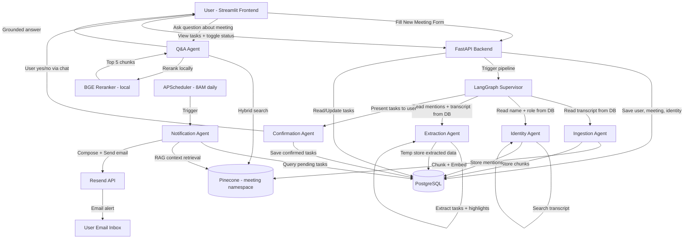

# ARCHITECTURE.md — MeetMind AI Meeting Assistant

---

## 1. SYSTEM OVERVIEW

MeetMind is an agentic AI meeting assistant that transforms raw meeting transcripts into structured, personalized, and actionable intelligence. A user submits a meeting transcript through a structured form along with their name, role, and organization. This data is immediately persisted to PostgreSQL, which becomes the single source of truth for all downstream agent operations. A multi-agent pipeline — orchestrated by LangGraph — then runs automatically: ingesting the transcript, identifying the user's presence and role in the meeting, extracting their assigned tasks and key highlights, and presenting those tasks for user confirmation before saving them to the dashboard. A separate Q&A agent allows the user to ask natural language questions about any stored meeting, answered using hybrid RAG retrieval scoped to that meeting's namespace in Pinecone. A scheduled Notification Agent checks daily for approaching deadlines and sends context-rich email alerts via Resend.

---

## 2. HIGH-LEVEL ARCHITECTURE DIAGRAM



---

## 3. COMPONENT BREAKDOWN

| Component | Technology | Responsibility |
|-----------|-----------|---------------|
| Frontend | Streamlit | 3-page UI: Landing, Workspace, Documentation |
| Backend | FastAPI + Uvicorn | REST API, pipeline trigger, request/response handling |
| ORM | SQLAlchemy + Alembic | DB models, schema migrations |
| Primary DB | PostgreSQL | Users, meetings, tasks, highlights, chat history, transcript chunks |
| Vector DB | Pinecone | Meeting transcript embeddings, per-meeting namespaces |
| Orchestrator | LangGraph | Multi-agent graph, state management, conditional routing |
| Supervisor Agent | gemini-3.6-flash | Plan-and-Execute orchestration, routes to sub-agents |
| Ingestion Agent | gemini-3.5-flash-lite | Parses transcript, chunks, embeds, stores to Pinecone + PostgreSQL |
| Identity Agent | gemini-3.5-flash-lite | Reads user identity from DB, extracts mentions from transcript |
| Extraction Agent | gemini-3.5-flash-lite | Extracts tasks + highlights from transcript for identified user |
| Confirmation Agent | gemini-3.5-flash-lite | Presents tasks to user, waits for confirmation, saves to DB |
| Q&A Agent | gemini-3.6-flash | Hybrid RAG Q&A scoped to one meeting namespace |
| Notification Agent | gemini-3.5-flash-lite | Deadline monitoring, AI email composition, Resend delivery |
| Embeddings | gemini-embedding-001 | 3072-dim dense vectors for transcript chunks |
| Reranker | BAAI/bge-reranker-v2-m3 | Local cross-encoder reranking of retrieved chunks |
| BM25 Search | rank-bm25 | Keyword search on transcript chunks stored in PostgreSQL |
| Email Service | Resend | Context-rich deadline alert emails |
| Scheduler | APScheduler | Daily 8AM trigger for Notification Agent inside FastAPI |
| Fallback LLM | thinkingmachines/inkling:free | OpenRouter fallback if Gemini quota exhausted |
| Backup LLM | openai/gpt-oss-120b | OpenRouter backup orchestrator |

---

## 4. DATA FLOW — NEW MEETING PIPELINE

```
Step 1:  User fills New Meeting Form on Streamlit frontend
         Fields: name, role, organization, date, time, transcript (paste/PDF/TXT)

Step 2:  Streamlit sends POST /api/v1/meetings/ to FastAPI

Step 3:  FastAPI saves to PostgreSQL:
         - users table (if new user)
         - meetings table (title extracted later, date/org/transcript stored)
         - meeting_participants table (user name + role + is_current_user = true)

Step 4:  FastAPI triggers LangGraph pipeline with meeting_id + user_id

Step 5:  Supervisor Agent reads meeting record from PostgreSQL
         Generates execution plan: ingest → identify → extract → confirm
         Routes to Ingestion Agent

Step 6:  Ingestion Agent reads raw transcript from PostgreSQL
         Extracts meeting metadata (title, participants list)
         Applies speaker-aware chunking (200-300 tokens per chunk)
         Embeds chunks using gemini-embedding-001
         Stores vectors to Pinecone under namespace: meeting_{meeting_id}
         Stores raw chunks to transcript_chunks table in PostgreSQL

Step 7:  Supervisor routes to Identity Agent
         Identity Agent reads user name + role from meeting_participants table
         Searches transcript chunks for all lines mentioning the user
         Stores user mentions back to PostgreSQL

Step 8:  Supervisor routes to Extraction Agent
         Extraction Agent reads user mentions + full transcript from PostgreSQL
         Extracts tasks assigned to or relevant to identified user
         Generates AI description per task
         Assigns priority (high/medium/low) based on urgency language
         Extracts key highlights and announcements relevant to user
         Stores extracted data temporarily to PostgreSQL (unconfirmed state)

Step 9:  Supervisor routes to Confirmation Agent
         Confirmation Agent presents task list to user in chat
         Shows: task title + description only (no deadlines, no priority)
         User responds: yes / no / partial
         Confirmed tasks saved permanently to tasks table
         Confirmed highlights saved to highlights table
         Unconfirmed tasks discarded

Step 10: FastAPI serves confirmed tasks to Streamlit dashboard
         Dashboard displays per-meeting view + unified view across all meetings
```

---

## 5. DATA FLOW — Q&A PIPELINE

```
Step 1:  User selects a meeting chat on Workspace page
Step 2:  User types a natural language question
Step 3:  Streamlit sends POST /api/v1/chat/{meeting_id}/message to FastAPI
Step 4:  FastAPI triggers Q&A Agent with question + meeting_id + user identity context
Step 5:  Q&A Agent runs hybrid search:
         - Semantic: Pinecone similarity search in meeting_{meeting_id} namespace (top 10)
         - Keyword: BM25 on transcript_chunks in PostgreSQL for that meeting_id (top 10)
Step 6:  Merge + deduplicate results (15-20 chunks)
Step 7:  BGE Reranker scores all chunks locally, returns top 5
Step 8:  Q&A Agent generates grounded answer using top 5 chunks + user identity context
Step 9:  Answer + source references returned to frontend
Step 10: Chat message stored in chat_messages table
```

---

## 6. DATA FLOW — NOTIFICATION PIPELINE

```
Step 1:  APScheduler fires daily at 08:00 AM inside FastAPI
Step 2:  Notification Agent queries PostgreSQL:
         tasks where status = pending AND deadline <= tomorrow AND alert_sent = false
Step 3:  For each task found:
         - Retrieve task context from Pinecone (top 3 chunks for that task)
         - AI composes context-rich email:
           subject, task title, deadline, description, transcript context
         - Send email via Resend API
         - Update alert_sent = true in PostgreSQL
```

---

## 7. DATABASE SCHEMA

### users
| Column | Type | Constraints |
|--------|------|-------------|
| id | UUID | PK, default gen_random_uuid() |
| name | VARCHAR(255) | NOT NULL |
| email | VARCHAR(255) | UNIQUE, NOT NULL |
| created_at | TIMESTAMP | DEFAULT now() |

### meetings
| Column | Type | Constraints |
|--------|------|-------------|
| id | UUID | PK |
| user_id | UUID | FK → users.id |
| title | VARCHAR(500) | extracted by Ingestion Agent |
| organization | VARCHAR(255) | from form |
| meeting_date | DATE | from form |
| meeting_time | VARCHAR(10) | from form |
| raw_transcript | TEXT | full original transcript |
| input_format | VARCHAR(10) | pdf / txt / text |
| pinecone_namespace | VARCHAR(255) | meeting_{meeting_id} |
| created_at | TIMESTAMP | DEFAULT now() |

### meeting_participants
| Column | Type | Constraints |
|--------|------|-------------|
| id | UUID | PK |
| meeting_id | UUID | FK → meetings.id |
| name | VARCHAR(255) | extracted from transcript |
| role | VARCHAR(255) | extracted or from form |
| is_current_user | BOOLEAN | DEFAULT false |

### tasks
| Column | Type | Constraints |
|--------|------|-------------|
| id | UUID | PK |
| meeting_id | UUID | FK → meetings.id |
| user_id | UUID | FK → users.id |
| title | VARCHAR(500) | NOT NULL |
| description | TEXT | AI-generated |
| priority | VARCHAR(10) | high / medium / low |
| deadline | DATE | nullable |
| status | VARCHAR(10) | pending / complete, DEFAULT pending |
| alert_sent | BOOLEAN | DEFAULT false |
| created_at | TIMESTAMP | DEFAULT now() |

### highlights
| Column | Type | Constraints |
|--------|------|-------------|
| id | UUID | PK |
| meeting_id | UUID | FK → meetings.id |
| user_id | UUID | FK → users.id |
| content | TEXT | NOT NULL |
| created_at | TIMESTAMP | DEFAULT now() |

### chat_messages
| Column | Type | Constraints |
|--------|------|-------------|
| id | UUID | PK |
| meeting_id | UUID | FK → meetings.id |
| user_id | UUID | FK → users.id |
| role | VARCHAR(10) | user / assistant |
| content | TEXT | NOT NULL |
| created_at | TIMESTAMP | DEFAULT now() |

### transcript_chunks
| Column | Type | Constraints |
|--------|------|-------------|
| id | UUID | PK |
| meeting_id | UUID | FK → meetings.id |
| chunk_index | INTEGER | NOT NULL |
| speaker_name | VARCHAR(255) | |
| speaker_role | VARCHAR(255) | |
| content | TEXT | raw chunk text |
| timestamp | VARCHAR(20) | from transcript |
| chunk_type | VARCHAR(20) | dialogue / decision / task_mention |
| involves_user | BOOLEAN | DEFAULT false |
| pinecone_vector_id | VARCHAR(255) | matching vector ID in Pinecone |

---

## 8. API ENDPOINTS

| # | Method | Endpoint | Purpose |
|---|--------|----------|---------|
| 1 | POST | /api/v1/users/register | Register user |
| 2 | GET | /api/v1/users/{user_id} | Get user profile |
| 3 | PUT | /api/v1/users/{user_id} | Update user |
| 4 | POST | /api/v1/meetings/ | Create meeting + trigger pipeline |
| 5 | GET | /api/v1/meetings/{user_id} | All meetings for user |
| 6 | GET | /api/v1/meetings/{meeting_id}/detail | Single meeting detail |
| 7 | DELETE | /api/v1/meetings/{meeting_id} | Delete meeting |
| 8 | GET | /api/v1/tasks/{user_id} | All tasks across meetings |
| 9 | GET | /api/v1/tasks/{user_id}/meeting/{meeting_id} | Tasks for one meeting |
| 10 | PUT | /api/v1/tasks/{task_id}/status | Toggle task status |
| 11 | GET | /api/v1/tasks/{user_id}/filter | Filter tasks by priority + date |
| 12 | POST | /api/v1/chat/{meeting_id}/message | Send Q&A message |
| 13 | GET | /api/v1/chat/{meeting_id}/history | Get chat history |
| 14 | DELETE | /api/v1/chat/{meeting_id}/history | Clear chat history |
| 15 | POST | /api/v1/extraction/{meeting_id}/run | Run extraction pipeline |
| 16 | GET | /api/v1/extraction/{meeting_id}/preview | Preview extracted tasks |
| 17 | POST | /api/v1/extraction/{meeting_id}/confirm | Confirm + save tasks |
| 18 | GET | /api/v1/highlights/{user_id}/meeting/{meeting_id} | Meeting highlights |
| 19 | GET | /api/v1/highlights/{user_id} | All highlights |
| 20 | POST | /api/v1/notifications/trigger | Manual notification trigger |
| 21 | GET | /api/v1/notifications/{user_id}/pending | Pending deadline alerts |

---

## 9. DEPLOYMENT ARCHITECTURE

| Service | Platform | Notes |
|---------|----------|-------|
| FastAPI Backend | Render (Web Service) | uvicorn, auto-deploy from main branch |
| PostgreSQL | Render (Managed PostgreSQL) | Free tier, 1GB storage |
| Streamlit Frontend | Vercel | Static + serverless, points to Render API |
| Pinecone | Pinecone Cloud (AWS us-east-1) | hackathon-index, 3072 dims, cosine |
| BGE Reranker | Inside Render container | Local, no external API |
| Resend | Resend Cloud | Email delivery, free tier |
| APScheduler | Inside FastAPI on Render | Runs as background job in same process |

```
┌─────────────────┐         ┌─────────────────────────────────┐
│   Vercel        │  HTTPS  │   Render                        │
│   Streamlit UI  │────────►│   FastAPI + LangGraph           │
│                 │◄────────│   APScheduler (Notification)    │
└─────────────────┘         │   BGE Reranker (local)          │
                            └────────────┬────────────────────┘
                                         │
                    ┌────────────────────┼────────────────────┐
                    │                    │                     │
                    ▼                    ▼                     ▼
             ┌──────────┐        ┌──────────────┐     ┌──────────┐
             │PostgreSQL│        │   Pinecone   │     │  Resend  │
             │ (Render) │        │  (AWS Cloud) │     │  (Email) │
             └──────────┘        └──────────────┘     └──────────┘
                                         │
                                         ▼
                                 ┌──────────────┐
                                 │ Gemini API   │
                                 │ OpenRouter   │
                                 │ (Fallback)   │
                                 └──────────────┘
```